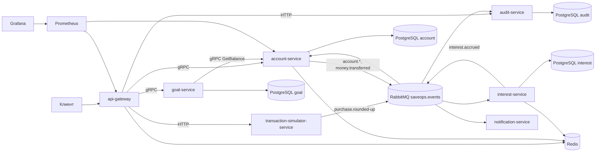

<p align="center">
  
</p>

<h1 align="center">SaveOps</h1>

SaveOps — микросервисная платформа для управления накопительными счетами, целями накопления, округлением покупок, начислением процентов, аудитом и mock-уведомлениями.

Проект показывает Java backend-навыки: Spring Boot 3, Java 21, gRPC, RabbitMQ, Redis, PostgreSQL, Flyway, Docker Compose, Prometheus, Grafana, Testcontainers и базовые SRE-практики.

<h2 align="center">Возможности</h2>

- Открытие накопительного счета, баланс, пополнение и списание.
- Ledger операций без возврата entity наружу.
- Цели накопления и расчет прогресса через баланс счета.
- Симуляция покупки и округление до 10/50/100 рублей.
- Асинхронные доменные события через RabbitMQ.
- Mock-уведомления с retry и dead-letter queue.
- Append-only audit log по `aggregateId`.
- Redis rate limiting, balance cache, idempotency keys, distributed lock.
- Метрики Actuator/Micrometer в Prometheus и dashboard в Grafana.

<h2 align="center">Технологический стек</h2>

Java 21, Spring Boot 3.x, Spring Web, Spring Data JPA, PostgreSQL, Flyway, RabbitMQ, Redis, gRPC, Maven, Docker Compose, Spring Boot Actuator, Micrometer, Prometheus, Grafana, JUnit 5, Testcontainers.

<h2 align="center">Архитектура</h2>



Подробности: [docs/architecture.md](docs/architecture.md).

<h2 align="center">Микросервисы</h2>

- `api-gateway` — REST API, Redis rate limiting, correlation-id, gRPC-клиенты.
- `account-service` — счета, balance cache, ledger, idempotency, RabbitMQ events, gRPC server.
- `goal-service` — цели накопления, PostgreSQL/Flyway, gRPC server и account gRPC client.
- `transaction-simulator-service` — симуляция покупок и событие `PurchaseRoundedUp`.
- `interest-service` — scheduled начисление процентов, Redis lock, история начислений.
- `notification-service` — consumer событий, mock-уведомления, retry queue и DLQ.
- `audit-service` — append-only audit log и поиск по `aggregateId`.
- `contracts` — `.proto` контракты и генерация Java gRPC-кода.
- `common` — общий envelope событий, correlation-id, error DTO.

<h2 align="center">Структура репозитория</h2>

```text
saveops/
├── services/
│   ├── api-gateway/
│   ├── account-service/
│   ├── goal-service/
│   ├── transaction-simulator-service/
│   ├── interest-service/
│   ├── notification-service/
│   └── audit-service/
├── contracts/
├── common/
├── docker/
├── docs/
├── docker-compose.yml
├── Makefile
└── README.md
```

<h2 align="center">Как запустить</h2>

```bash
make build
make up
```

Ссылки:

- Gateway: `http://localhost:8080`
- RabbitMQ Management: `http://localhost:15672` (`saveops/saveops`)
- Prometheus: `http://localhost:9090`
- Grafana: `http://localhost:3000` (`admin/admin`)

Остановка:

```bash
make down
```

<h2 align="center">Как проверить работу</h2>

```bash
curl -X POST http://localhost:8080/api/accounts \
  -H 'Content-Type: application/json' \
  -H 'X-Correlation-Id: demo-1' \
  -d '{"ownerId":"user-1","currency":"RUB"}'

curl -X POST http://localhost:8080/api/goals \
  -H 'Content-Type: application/json' \
  -d '{"ownerId":"user-1","accountId":"<accountId>","name":"Подушка","targetAmount":100000,"currency":"RUB"}'

curl -X POST http://localhost:8080/api/purchases/simulate \
  -H 'Content-Type: application/json' \
  -d '{"userId":"user-1","accountId":"<accountId>","amount":187.30,"roundTo":100}'

curl http://localhost:8080/api/accounts/<accountId>/balance
curl http://localhost:8080/api/audit/<accountId>
```

<h2 align="center">REST API</h2>

- `POST /api/accounts`
- `GET /api/accounts/{accountId}/balance`
- `POST /api/accounts/{accountId}/deposit`
- `POST /api/accounts/{accountId}/withdraw`
- `POST /api/goals`
- `GET /api/goals/{goalId}`
- `GET /api/goals/{goalId}/progress`
- `POST /api/purchases/simulate`
- `GET /api/audit/{aggregateId}`

<h2 align="center">gRPC</h2>

`account-service` предоставляет:

- `GetBalance`
- `CreateAccount`
- `DepositMoney`
- `WithdrawMoney`
- `ListAccounts`

`goal-service` предоставляет создание цели, получение цели и прогресс. Gateway и goal-service используют deadline 2 секунды; gateway делает короткий retry для `UNAVAILABLE` и `DEADLINE_EXCEEDED`.

<h2 align="center">RabbitMQ</h2>

Exchange: `saveops.events`.

Routing keys:

- `account.opened`
- `account.closed`
- `money.transferred`
- `purchase.rounded-up`
- `interest.accrued`
- `notification.failed`

Envelope события: `eventId`, `eventType`, `aggregateId`, `occurredAt`, `correlationId`, `payload`.

<h2 align="center">Redis</h2>

- `api-gateway`: rate limiting по IP.
- `account-service`: idempotency key для денежных операций и cache balance read model.
- `interest-service`: distributed lock для scheduled начисления процентов.

<h2 align="center">Мониторинг</h2>

Все сервисы публикуют `/actuator/health`, `/actuator/health/readiness`, `/actuator/prometheus`.

Бизнес-метрики:

- `saveops_accounts_created_total`
- `saveops_money_transfers_total`
- `saveops_interest_accrued_total`
- `saveops_notifications_sent_total`
- `saveops_notification_failures_total`

Prometheus config: [docker/prometheus/prometheus.yml](docker/prometheus/prometheus.yml). Dashboard: [docker/grafana/dashboards/saveops-overview.json](docker/grafana/dashboards/saveops-overview.json).

<h2 align="center">SLI/SLO и Runbooks</h2>

SLI/SLO и alerting описаны в [docs/sre.md](docs/sre.md).

Runbooks:

- [High RabbitMQ backlog](docs/runbooks/high-rabbitmq-backlog.md)
- [High gRPC error rate](docs/runbooks/high-grpc-error-rate.md)
- [Interest accrual failed](docs/runbooks/interest-accrual-failed.md)

<h2 align="center">Команды разработки</h2>

```bash
make build
make test
make up
make down
make logs service=account-service
```

<h2 align="center">План развития</h2>

- Добавить OpenAPI спецификацию gateway.
- Добавить outbox pattern для надежной публикации событий.
- Добавить отдельные users/profile сервисы.
- Добавить policy-based rate limiting по пользователю.
- Добавить алерты Prometheus Alertmanager.

<h2 align="center">Timeline разработки</h2>

Коммиты выполнены в формате Conventional Commits по milestone-плану:

- 21 декабря: инициализация monorepo и Maven/Java 21.
- 22 декабря: Docker Compose для PostgreSQL/Redis/RabbitMQ и gRPC proto contracts.
- 23 декабря: account domain, Flyway и gRPC endpoints.
- 24 декабря: REST api-gateway, validation и global error handling.
- 25 декабря: goal domain и интеграция с account gRPC.
- 26 декабря: RabbitMQ routing и account domain events.
- 27 декабря: симулятор покупок и `purchase.rounded-up`.
- 28 декабря: notification consumer, retry и DLQ.
- 29 декабря: audit storage и API поиска.
- 30 декабря: Redis idempotency keys и balance cache.
- 31 декабря: interest accrual job и Redis distributed lock.
- 1 января: Actuator/Prometheus и custom business metrics.
- 2 января: Prometheus и Grafana provisioning.
- 3-4 января: unit и Testcontainers integration tests.
- 5-6 января: common contracts, correlation-id propagation, gRPC deadlines/retry.
- 7-9 января: SRE docs, runbooks, README, Makefile и docker compose readiness.

<h2 align="center">Проверочный чеклист</h2>

- Flyway migrations есть в `services/account-service`, `services/goal-service`, `services/interest-service`, `services/audit-service`.
- `.proto` файлы находятся в `contracts/src/main/proto`.
- Prometheus config: `docker/prometheus/prometheus.yml`.
- Grafana dashboard: `docker/grafana/dashboards/saveops-overview.json`.
- Production-like JPA режим использует `ddl-auto=validate`.
