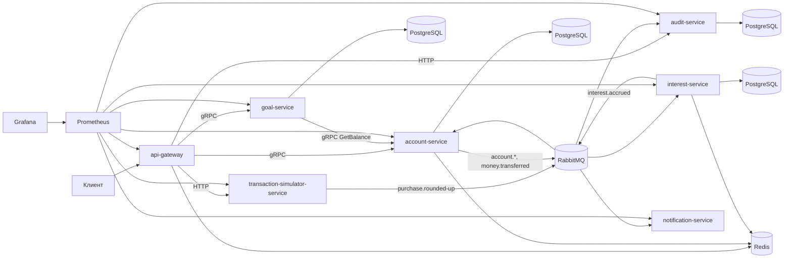

# Архитектура SaveOps

SaveOps построен как monorepo с независимыми Spring Boot сервисами. Внешний трафик принимает `api-gateway`, а внутренние синхронные вызовы к `account-service` и `goal-service` идут через gRPC с deadline и retry для временных сетевых ошибок.

Асинхронное взаимодействие идет через RabbitMQ exchange `saveops.events`. События имеют единый envelope: `eventId`, `eventType`, `aggregateId`, `occurredAt`, `correlationId`, `payload`.

## Основной сценарий

1. Пользователь создает счет через `POST /api/accounts`.
2. `api-gateway` вызывает `account-service` по gRPC.
3. `account-service` сохраняет счет, кеширует баланс в Redis и публикует `account.opened`.
4. Пользователь создает цель через `POST /api/goals`.
5. Пользователь симулирует покупку через `POST /api/purchases/simulate`.
6. `transaction-simulator-service` публикует `purchase.rounded-up`.
7. `account-service` зачисляет округление на счет и публикует `money.transferred`.
8. `notification-service` логирует mock-уведомления.
9. `audit-service` пишет append-only audit log.
10. `interest-service` по расписанию начисляет проценты с Redis lock.

